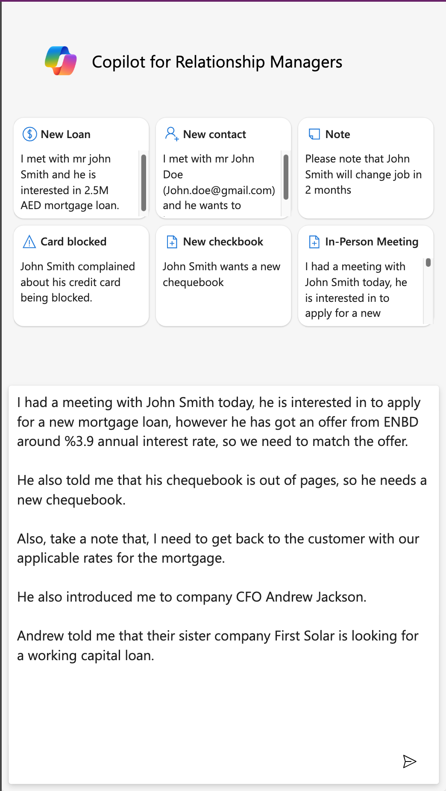
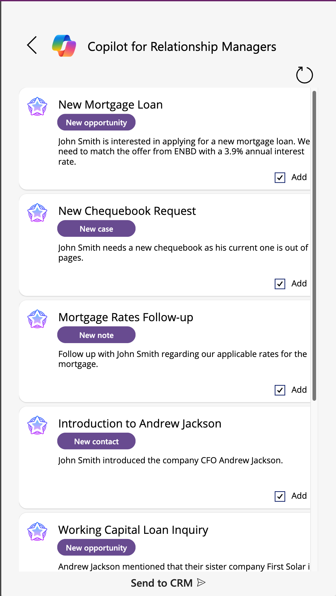
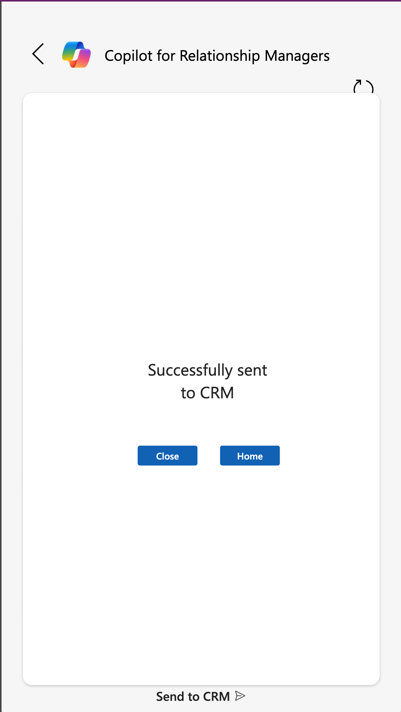

### ⚠️⚠️⚠️ IMPORTANT DISCLAIMER ⚠️⚠️⚠️

> **This solution is a DEMO-GRADE prototype built for concept demonstration purposes ONLY. It is NOT intended for use in a production environment.**

> ⚠️ **Use at your own risk.** This app may contain incomplete features, potential security flaws, or generate inaccurate CRM entries.

> **The creators of this repository do not bear any responsibility** for any direct or indirect damage, data loss, or business impact caused by deploying or using this solution in a live environment.

---

# RM Copilot – AI-Powered Call Report Assistant for Relationship Managers

**RM Copilot** is a demonstration-grade Power App designed to revolutionize how Relationship Managers (RMs) in retail and corporate banking log customer interactions. By combining the power of **GPT-4o**, **AI Builder**, **Power Automate**, and **Dynamics 365**, RM Copilot enables fast, voice-driven CRM updates—saving time and improving data quality.

---

## 🔍 Use Case

Relationship Managers often spend hours manually entering meeting notes and customer engagement data into CRM systems. RM Copilot simplifies this process.

With RM Copilot, the RM simply:

1. Opens the app on their mobile device.
2. Taps to dictate a summary of the customer interaction.
3. Speaks naturally, describing:
   - Who they met with
   - Topics discussed
   - Any required follow-up actions or CRM updates

The AI-powered backend then analyzes the input and automatically:

- Captures new **leads**, **opportunities**, **complaints**, or **service requests**
- Links all records to a new **Call Report** in **Dynamics 365 CRM**
- Allows the RM to **review and confirm** the data before saving

---

## ⚙️ Components Used

This demo solution leverages the following Microsoft technologies:

| Component         | Purpose                                                       |
|------------------|---------------------------------------------------------------|
| **Power Apps**    | Front-end mobile app interface for RMs                        |
| **AI Builder**    | GPT-4o-based model to analyze spoken summaries                |
| **Power Automate**| Orchestration of AI calls and Dynamics 365 data operations   |
| **Dynamics 365**  | Storage and linking of CRM records (leads, cases, reports)    |
| **Azure OpenAI / GPT-4o** | Language understanding and entity extraction         |
| **Dataverse**     | Underlying data layer and table schema                        |

---

## ✅ Benefits

- **Time-saving**: Drastically reduces manual CRM data entry effort
- **Voice-first experience**: Uses the smartphone's built-in dictate functionality
- **Improved data capture**: Ensures more complete and accurate meeting records
- **Smart automation**: Automatically classifies and creates CRM entries
- **Review-before-commit**: Human-in-the-loop validation before data is saved

---

## 🔁 End-to-End Flow

1. **User Input**: RM uses their phone to dictate the meeting summary.
2. **Transcription & AI Processing**:
   - The app captures the dictated summary.
   - AI Builder + GPT-4o models analyze and extract intent and entities.
3. **Automated Record Creation**:
   - Power Automate orchestrates the flow to:
     - Create leads, opportunities, or service requests.
     - Link them into a unified Call Report record.
4. **CRM Review**:
   - RM logs into Dynamics 365.
   - Reviews and corrects the autogenerated Call Report if needed.

---

## 📷 Screenshots

  
  
  

---

## 🚀 Getting Started

> ⚠️ This solution is intended for demo purposes only. Do not use in a production environment.

### Prerequisites

- Microsoft Power Platform license (Power Apps, AI Builder)
- Access to Dynamics 365 environment (Customer Service or Sales)
- Azure OpenAI access for GPT-4o (if not using AI Builder directly)
- GitHub CLI or Power Platform CLI for solution deployment

### Installation Steps

1. Import the solution packages in the given order to your dataverse environment.
2. Publish all the apps and flows in the solution

### 🧠 Notes

- All AI interpretations are **probabilistic** and may require RM verification.
- **Call Report** schema must be available in the Dynamics environment.
- Voice dictation depends on **device/browser compatibility**.
- **AI Builder quota** and **OpenAI usage** may apply depending on your licensing model.

---

### 📬 Contact

For feedback, feature suggestions, or collaboration, feel free to open an issue or reach out via **[your contact details]**.
